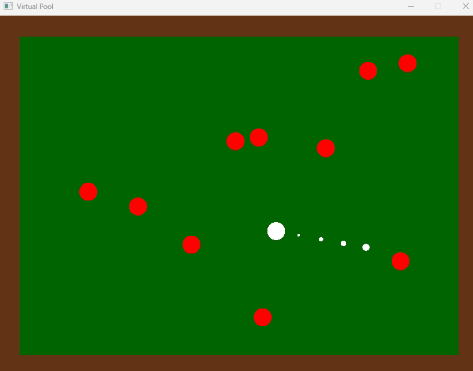

# Pool Game

This is a simple physics simulation to help practice and get experience with handling rigidbody collisions. 

## How to run

 - clone repo
 - make sure you have a rust compiler installed
 - be sure to cd into repo from a terminal application
 - run `cargo build` to build the exe in target/debug
 - the project depends on some SFML2 dlls so go to the [SFML downloads page](https://www.sfml-dev.org/download/sfml/2.6.2/) and download the appropriate files for your machine
 - after they are downloaded either add the bin folder to your system path or copy the contents of the bin folder into the target/debug folder alongside the exe file.
 - you can either double click the exe or use `cargo run` to run the program
