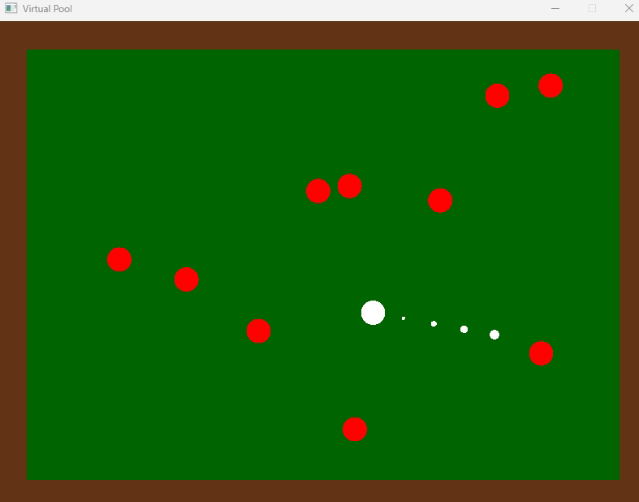

# Pool Game

This is a simple physics simulation to help practice and get experience with handling rigidbody collisions. 

## How to run

 - clone repo
 - make sure you have a [rust](https://www.rust-lang.org/) compiler installed at version 1.82 or later
 - make sure you have [cmake](https://cmake.org/)
 - linux has some extra dependencies that can be found [here](https://crates.io/crates/sfml/0.24.0)
 - be sure to cd into repo from a terminal application
 - run `cargo build` to build the exe in target/debug
 - you can either double click the exe in target/debug or use `cargo run` to run the program
